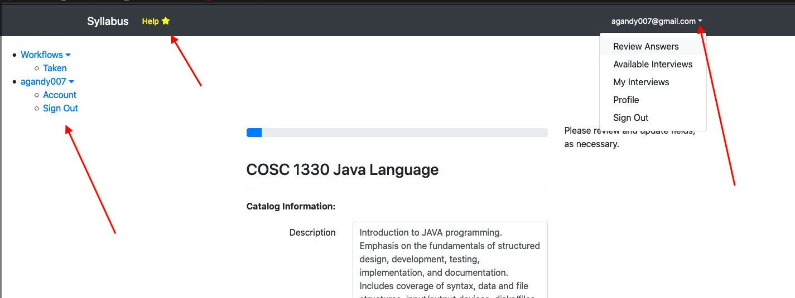

## How do I navigate the application?  

**Top Menu Bar**
Within interviews / form questions, you may see a 'Help' link highlighted. This indicates that page specific help is available.

**Upper Left Links**
These shortcuts are availabel in and out of forms.

**Upper Right Dropdown Menu**
A dropdown menu is available by clicking the chevron next to the user's email address. New menu items may become available for different areas of the tool. 

## Application Terms Used in Nvaigation
**Workflows** Synonymous with *form* or *interview*. Since this application can be used for different document automation processess, these genral terms are used by the vendor to describe the online forms used to gather data.

**Taken** Represents a started or completed form, (or workflow / interview.)

**Interviews** Synonymous with *form* or *interview*. 

**Review Answers** While working within a syllabus form, users may use this link to revisit previous answers to online questions. Useful for editing or updating taken interviews.

